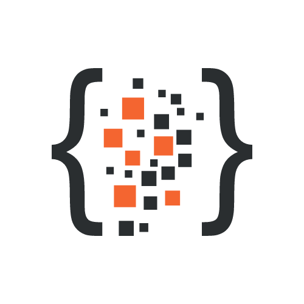

# TagScript

**A simple and safe template engine.**

**Packages**

## Description

TagScript is a drop in easy to use string interpreter that lets you provide users with ways of customizing their profiles or chat rooms with interactive text.

Read Full Documentation [here](https://tagscript.js.org/).

## Features

-   Written In Typescript
-   Offers CJS, ESM and UMD builds
-   Full TypeScript & JavaScript support
-   Faster than ⚡
-   Simple, expressive and safe template engine.
-   Supports many [plugins](https://github.com/imranbarbhuiya/tagscript/packages/).

## Buy me some doughnuts

If you want to support me by donating, you can do so by using any of the following methods. Thank you very much in advance!

## Contributors ✨

Thanks goes to these wonderful people ([emoji key](https://allcontributors.org/docs/en/emoji-key)):

<!-- ALL-CONTRIBUTORS-LIST:START - Do not remove or modify this section -->
<!-- prettier-ignore-start -->
<!-- markdownlint-disable -->
<table>
  <tr>
    <td align="center"><a href="https://github.com/imranbarbhuiya"> <b>Parbez</b></a> <a href="https://github.com/imranbarbhuiya/TagScript/commits?author=imranbarbhuiya" title="Code">💻</a> <a href="#maintenance-imranbarbhuiya" title="Maintenance">🚧</a> <a href="#ideas-imranbarbhuiya" title="Ideas, Planning, & Feedback">🤔</a></td>
    <td align="center"><a href="https://renovate.whitesourcesoftware.com"> <b>WhiteSource Renovate</b></a> <a href="#maintenance-renovate-bot" title="Maintenance">🚧</a></td>
    <td align="center"><a href="https://favware.tech"> <b>Jeroen Claassens</b></a> <a href="#maintenance-favna" title="Maintenance">🚧</a></td>
  </tr>
</table>

<!-- markdownlint-restore -->
<!-- prettier-ignore-end -->

<!-- ALL-CONTRIBUTORS-LIST:END -->

This project follows the [all-contributors](https://github.com/all-contributors/all-contributors) specification. Contributions of any kind welcome!

## Projects using TagScript

-   [R.O.T.I](https://discord.com/api/oauth2/authorize?client_id=903690362114158632&scope=applications.commands+bot&permissions=1543892063) by @imranbarbhuiya using TagScript for their tag module.
